# Audit Stratégique & Opérationnel — Grafikaly (`grafikaly.mg`)

> **Date de l'audit :** 1er octobre 2026  
> **Périmètre analysé :** Site en production `https://www.grafikaly.mg` (rendu SSR, payloads d'hydratation TanStack Router `$_TSR.router`, bundles JavaScript publics et back-office `/admin/*`), espace de travail local `c:\Users\sylvi\DEV\GRAFIKALY` et connecteurs MCP.  
> **Statut :** Mode **AUDIT & PLANIFICATION uniquement** — aucune modification n'a été effectuée sur le site, les prix, les contacts, les automatisations ou les campagnes.

---

## 1. Inventaire des accès : ce qui a été consulté vs ce qui manque

### 1.1 Ce qui a réellement pu être consulté (Sources vérifiées au 01/10/2026)

1. **Pages publiques et payloads de données SSR (`$_TSR.router`) de `https://www.grafikaly.mg` (consultés le 01/10/2026) :**
   - Accueil (`/`) : paramètres globaux (`settings`), catégories actives, produits vedettes (`featuredProducts`), ventes flash (`flashSale`), avis mis en avant (`featuredReviews`), et les **18 derniers achats vérifiés** (`recentPurchases` du `16/09/2026` au `29/09/2026`).
   - Boutique (`/boutique`) & les **20 fiches produits actives** (`/produits/$slug`) : prix en MGA, prix barrés, variantes, types de produits (`shared_credentials`, `personal_activation`, `digital_license`), champs personnalisés requis, règles d'éligibilité aux codes promo (`promo_code_enabled`), et **état exact des stocks/places occupées** (`digital_inventory` : `total_slots`, `used_slots`, `available_licenses`, `used_licenses`).
   - Packs & Offres (`/offres`) : les **2 packs actifs** (`ULTIMATE IA PACK` et `PACK RÉUNION PRO`, créés/mis à jour le `01/10/2026 à 07:04 UTC`).
   - Créateur de combo (`/combo`) : les **3 paliers de remise** actifs (`-5%` dès 2 produits, `-10%` dès 3, `-15%` dès 4) et les **8 produits éligibles**.
   - Service de création de site (`/services/creation-site-ecommerce`) : les **3 formules tarifaires** (`349 000 Ar/an`, `649 000 Ar/an`, `1 400 000 Ar/an`) et le tunnel de qualification en 5 étapes.
   - Pages opérationnelles : `/comment-ca-marche` (incluant la table `paymentMethods`), `/faq` (10 questions/réponses actives), `/support`, `/contact`, `/auth`, `/panier`, `/fidelite`.
2. **Architecture applicative & code Front/Admin compilé (`/assets/*.js` en production au 01/10/2026) :**
   - Inspection des modules d'administration : `/admin/marketing` (`marketing-DxAcY_2B.js`), `/admin/emails` (`emails-D3er-vpD.js`), `/admin/abonnements` (`abonnements-DDxJymw_.js`), `/admin/statistiques` (`statistiques-CgOkeV9X.js`), `/admin/combos` (`combos-COW8b-sG.js`), `/admin/codes-promo` (`codes-promo-CyhK2bxG.js`).
   - Cela a permis de cartographier **l'intégralité des fonctionnalités construites** (les 28 templates d'emails, les 6 segments d'audience, les 2 automatisations, la gestion des comptes maîtres et transferts de slots) sans avoir besoin d'exécuter quoi que ce soit.
3. **Espace de travail local & Outils connectés (consultés le 01/10/2026) :**
   - Dossier local `c:\Users\sylvi\DEV\GRAFIKALY` : **totalement vide** (0 fichier, pas de dépôt Git local ni d'export CSV/JSON).
   - Serveurs MCP disponibles : `canva` et `stitch` (utiles plus tard pour la création visuelle, mais aucun connecteur direct vers la base PostgreSQL/Supabase ou le fournisseur d'envoi d'emails).

### 1.2 Liste des données manquantes (inaccessibles sans accès back-office ou exports)

> [!IMPORTANT]
> Pour passer d'un audit externe/technique à un pilotage financier et CRM précis, les données suivantes sont aujourd'hui absentes du projet :

1. **Données financières et marges réelles :**
   - Chiffre d'affaires réel encaissé (7j / 30j / 90j / 12 mois) dans `/admin/statistiques`.
   - Coût d'achat unitaire (COGS) de chaque compte maître (Netflix, Prime, Spotify Famille, Canva Éducation, licences IA annuelles) et mode de paiement fournisseur (carte bancaire internationale, devise EUR/USD, taux de change + frais bancaires).
   - Coûts fixes mensuels (hébergement Lovable Cloud / Supabase / Cloudflare R2, service d'envoi d'emails transactionnels/marketing, budget publicitaire Facebook Ads, salaires/opérateurs support).
2. **Données CRM, Base Clients & Abonnements (`/admin/abonnements` & `/admin/marketing`) :**
   - Taille exacte des 6 audiences dans `/admin/marketing` : nombre de contacts total, nombre en `consent_pending` (clients de l'ancien/nouveau site n'ayant pas encore donné leur accord), nombre d'`all_consented`, nombre de désinscrits (`revoked`), nombre d'abonnés actifs (`subscriptions_active`) et nombre d'**abonnements coupés** (`subscriptions_cut`).
   - Taux de renouvellement réel à l'échéance (1 mois / 3 mois / 12 mois) et volume d'abonnements actuellement en statut « Expiré non coupé » (`last-call`).
3. **État réel des automatisations et délivrabilité emailing (`/admin/emails` & `/admin/marketing`) :**
   - Savoir si les 2 automatisations (`abandoned_cart` et `pre_renewal`) sont actuellement basculées sur **Activée (`true`)** ou **Désactivée (`false`)** en base.
   - Journal d'envoi (`/admin/emails` > Journal) : taux de livraison réelle vs erreurs/bounces, et historique des campagnes manuelles déjà envoyées.
4. **Données d'acquisition et de trafic :**
   - Trafic du site (`/~flock.js` / Google Analytics / Search Console), coût par clic / coût par acquisition Facebook Ads, et volume de commandes passées en direct sur **WhatsApp** (`+261 38 42 080 80`) hors tunnel web.
5. **Code source du projet :**
   - Le dépôt Git du site TanStack Start / Lovable Cloud n'est pas cloné dans `c:\Users\sylvi\DEV\GRAFIKALY`.

---

## 2. Reconstitution du fonctionnement actuel de Grafikaly

```mermaid
flowchart LR
    subgraph Acquisition["1. Acquisition"]
        FB["Facebook (grafikaly)"]
        WA["WhatsApp (+261 38 42 080 80)"]
        Direct["Accès direct / Ancien site"]
    end

    subgraph Tunnel["2. Tunnel Site Web (grafikaly.mg)"]
        Cat["Catalogue : 20 produits, 2 packs, 1 service"]
        Auth["Connexion / Création compte obligatoire"]
        Panier["Panier + Champs requis (Email / Profil)"]
        Pay["Paiement Mobile Money USSD (Mvola / Orange Money)"]
        Preuve["Envoi réf. transaction + capture d'écran"]
    end

    subgraph Ops["3. Opérations & Livraison"]
        Verif["Vérification manuelle Admin (< 1h)"]
        Livr["Attribution Slot Compte Maître ou Activation (< 2h)"]
        Abo["Suivi dans /admin/abonnements"]
    end

    subgraph Lifecycle["4. Cycle de vie & Emailing"]
        RelancePanier["Relance Panier (H+1, J+1, J+3 + Code Promo)"]
        Avis["Demande d'avis -> Code MERCI-xxxx (-10%)"]
        Renouv["Pré-renouvellement (J-30, J-7, J-1 ou J-3) + Dernier Rappel"]
        Reac["Campagnes Segments (Abonnements coupés, Dormants)"]
    end

    Acquisition --> Tunnel --> Ops --> Lifecycle
```

### 2.1 Offres, Prix et Stock/Occupation (Faits vérifiés au 01/10/2026)

Le modèle économique de Grafikaly repose sur **3 piliers** libellés en **Ariary (`MGA`)** :

#### Pilier A : Abonnements Streaming, Musique & Divertissement (revenus récurrents mensuels/trimestriels)
*Source : payload SSR `/boutique` et `/produits/$slug` au 01/10/2026.*

| Produit | Catégorie assignée | Type technique | Prix & Variantes (MGA) | Occupation / Stock (`digital_inventory` au 01/10/2026) | Code promo autorisé (`promo_code_enabled`) |
| :--- | :--- | :--- | :--- | :--- | :--- |
| **NETFLIX \| SMARTPHONE/PC Uniquement** *(Vedette)* | Streaming vidéo | `shared_credentials` | 1m : `24 500 Ar` 2m : `49 000 Ar` 3m : `69 000 Ar` *(barré 73 500)* 6m : `125 000 Ar` *(barré 138 000)* | **34 / 53 places occupées** (`available` — 19 places libres) | **OUI (`true`)** |
| **NETFLIX \| Smart TV** | Streaming vidéo | `shared_credentials` | 1m : `24 500 Ar` 2m : `49 000 Ar` 3m : `69 000 Ar` *(barré 73 500)* 6m : `125 000 Ar` *(barré 138 000)* | **10 / 12 places occupées** (`low_availability` — **2 places libres**) | NON (`false`) |
| **PRIME VIDEO** | Streaming vidéo | `shared_credentials` | 1m : `19 500 Ar` 2m : `39 000 Ar` 3m : `49 000 Ar` *(barré 58 500)* 6m : `89 000 Ar` *(barré 98 000)* | **18 / 30 places occupées** (`available` — 12 places libres) | NON (`false`) |
| **CRUNCHYROLL MEGAFAN** | Streaming vidéo | `shared_credentials` | 1m : `14 500 Ar` 3m : `39 000 Ar` *(barré 43 500)* 6m : `74 500 Ar` *(barré 87 000)* | **6 / 15 places occupées** (`available` — 9 places libres) | NON (`false`) |
| **SPOTIFY PREMIUM** | ⚠️ **Aucune (`null`)** | `personal_activation` | 3m : `49 000 Ar` (`2/32`) 6m : `89 000 Ar` *(barré 98 000)* (`1/32`) 12m : `129 000 Ar` *(barré 174 000)* (`1/32`) | **19 / 32 places occupées** au global (`on_demand`) | NON (`false`) |
| **DRAMABOX VIP** | ⚠️ **Aucune (`null`)** | `shared_credentials` | Base affichée : `24 500 Ar` ("01 mois") Variantes réelles : 3m `49 000 Ar`, 6m `89 000 Ar` | **1 / 3 places occupées** (`low_availability`) | NON (`false`) |
| **DUOLINGO SUPER** *(Vedette)* | Divertissements | `shared_credentials` | 12m : `98 000 Ar` | **0 / 10 places occupées** (`available`) | NON (`false`) |
| **GTA VI - PS5 \| pré-commande** | Divertissements | `shared_credentials` | Pré-commande : `349 000 Ar` *(barré 430 000)* | **0 / 3 places occupées** (`available`) | NON (`false`) |

#### Pilier B : Outils IA, Productivité, Stockage & Licences Pro (paniers élevés, majoritairement 12 mois)
*Source : payload SSR `/boutique` et `/produits/$slug` au 01/10/2026.*

| Produit | Catégorie assignée | Type technique | Prix & Variantes (MGA) | Occupation / Stock (`digital_inventory` au 01/10/2026) | Code promo autorisé |
| :--- | :--- | :--- | :--- | :--- | :--- |
| **Canva Pro Éducation** *(Vedette)* | Outils IA | `personal_activation` | **Essentiel** : 1m `14 500 Ar`, 3m `39 000 Ar`, 6m `69 000 Ar`, 12m `98 000 Ar` **Complet (Brand Kit + IA)** : 6m `125 000 Ar`, 12m `189 000 Ar` | **66 / 80 places occupées** (`available` — 82,5 % de remplissage) | NON (`false`) |
| **Claude PRO \| Compte partagé** | Outils IA | `shared_credentials` | 30 jours : `45 000 Ar` *(barré 89 000)* | **3 / 3 places occupées** (**EN RUPTURE** / `unavailable`) | NON (`false`) |
| **HOSTINGER BUSINESS 3 en 1** *(Vedette !)* | Outils IA | `shared_credentials` | 12m : `489 000 Ar` | **1 / 1 place occupée** (**EN RUPTURE** / `unavailable`) | NON (`false`) |
| **DESCRIPT CREATOR** *(Vedette)* | Outils IA | `personal_activation` | 12m : `349 000 Ar` | **2 / 5 licences utilisées** (`low_availability`) | NON (`false`) |
| **HIGGSFIELD PRO** *(Vedette)* | Outils IA | `personal_activation` | 12m : `849 000 Ar` | **1 / 2 licences utilisées** (`low_availability`) | NON (`false`) |
| **GOOGLE AI PRO** | Outils IA | `personal_activation` | 12m : `289 000 Ar` | **1 / 11 places occupées** (`available`) | NON (`false`) |
| **LOVABLE PRO** *(Vedette)* | Outils IA | `personal_activation` | 12m : `349 000 Ar` *(barré 469 000)* | **0 / 2 licences utilisées** (`low_availability`) | NON (`false`) |
| **NOTION BUSINESS** | Outils IA | `personal_activation` | 3m : `69 000 Ar` *(barré 349 000)* 12m : `249 000 Ar` | **0 / 2 licences utilisées** (`low_availability`) | NON (`false`) |
| **GAMMA PRO** | Outils IA | `personal_activation` | 12m : `289 000 Ar` | **0 / 5 licences utilisées** (`available`) | NON (`false`) |
| **FRAMER PRO** *(Vedette)* | Outils IA | `personal_activation` | 12m : `189 000 Ar` | **0 / 5 licences utilisées** (`available`) | NON (`false`) |
| **GRANOLA AI BUSINESS** | Outils IA | `personal_activation` | `169 000 Ar` *(durée non précisée)* | **0 / 5 licences utilisées** (`available`) | NON (`false`) |
| **WISPR FLOW PRO** | Outils IA | `shared_credentials` | 12m : `249 000 Ar` *(barré 620 000)* | **0 / 3 places occupées** (`available`) | NON (`false`) |
| **STOCKAGE GOOGLE Extension** | ⚠️ **Aucune (`null`)** | `personal_activation` | 12m : 100Go `125 000 Ar`, 200Go `198 000 Ar`, 1To `289 000 Ar` | **2 / 9 places occupées**, mais marqué **EN RUPTURE (`unavailable`)** | NON (`false`) |
| **COURSERA PRO \| 12 MOIS** | ⚠️ **Aucune (`null`)** | `personal_activation` | 12m : `249 000 Ar` *(barré 389 000)* | **1 / 1 licence utilisée** (**EN RUPTURE** / `unavailable`) | NON (`false`) |
| **LINKEDIN PREMIUM BUSINESS** | ⚠️ **Aucune (`null`)** | `personal_activation` | 2m : `129 000 Ar`, 6m : `349 000 Ar`, 12m : `589 000 Ar` | **0 / 3 licences utilisées** (`available`) | NON (`false`) |
| **LINKEDIN PREMIUM CAREER** | ⚠️ **Aucune (`null`)** | `personal_activation` | 2m : `129 000 Ar`, 6m : `289 000 Ar` | **0 / 2 licences utilisées** (`available`) | NON (`false`) |
| **LINKEDIN SALES NAVIGATOR ADV.** | ⚠️ **Aucune (`null`)** | `personal_activation` | 1m : `149 000 Ar` *(barré 690 000)* | **0 / 1 licence utilisée** (`on_demand`) | NON (`false`) |
| **N8N Starter** | ⚠️ **Aucune (`null`)** | `personal_activation` | 12m : `249 000 Ar` *(barré 425 000)* | **0 / 1 licence utilisée** (`low_availability`) | NON (`false`) |
| **Licence WINDOWS PRO** | Logiciels et licences | `shared_credentials` (!) | Win 10 : `39 000 Ar`, Win 11 : `39 000 Ar` | **1 licence Win 11 utilisée** (`available`) | NON (`false`) |
| **McAfee PREMIUM** | Logiciels et licences | `digital_license` | Antivirus 1PC `69 000 Ar` (`1/2`), Internet Sec. `69 000 Ar` (`0/2`), Total Prot. `95 000 Ar` (`0/1`) | **1 / 5 licences utilisées** au total | NON (`false`) |

*(Note : sur les 28 entrées ci-dessus, 20 sont retournées dans le flux public `/boutique` et 8 produits supplémentaires ont été extraits via leurs URLs directes `/produits/$slug` car ils sont soit en rupture `unavailable`, soit sur demande `on_demand`.)*

#### Pilier C : Packs (`/offres`), Combos (`/combo`) & Services Digitaux (`/services/creation-site-ecommerce`)
1. **2 Packs actifs sur `/offres` (créés/mis à jour le 01/10/2026 à 07:04 UTC) :**
   - **ULTIMATE IA PACK** (`649 000 Ar` au lieu de `887 000 Ar`, soit `-30%`) : Lovable Pro 12m + N8N Starter 12m + Google AI Pro 12m.
   - **PACK RÉUNION PRO** (`682 880 Ar` au lieu de `776 000 Ar`, soit `-12%`) : Granola AI Business + Gamma Pro 12m + Notion Business 3m + Wispr Flow Pro 12m.
2. **Créateur de Combo (`/combo`) :**
   - Remise automatique de `-5%` (2 produits), `-10%` (3 produits), `-15%` (4 produits).
   - Seuls **8 produits sans variantes** y sont activés (`Gamma Pro`, `Duolingo Super`, `Granola AI`, `Framer Pro`, `Lovable Pro`, `GTA VI PS5`, `Descript Creator`, `Higgsfield Pro`).
3. **Service « Création de site e-commerce opérationnel en 24h » (`/services/creation-site-ecommerce`) :**
   - **Formule Essentiel (`349 000 Ar/an`)** : jusqu'à 20 produits, structure simple, hébergement 1 an inclus, support 7j.
   - **Formule Business (`649 000 Ar/an` — recommandée)** : jusqu'à 100 produits, pages complémentaires, recherche/filtres, formation 30 min, support 30j.
   - **Formule Sur mesure (`À partir de 1 400 000 Ar/an`)** : design sur mesure, espace client, automatisations, support prioritaire.

---

### 2.2 Parcours d'achat, Paiement et Fidélité

1. **Parcours client vérifié :**
   - Ajout au panier (avec saisie obligatoire d'un champ personnalisé selon le produit : ex. adresse email à activer ou nom du profil souhaité).
   - **Création de compte obligatoire** pour commander (Email + mot de passe avec confirmation par email, ou Google OAuth).
   - **Migration ancien site :** Le composant `/auth` (`auth-B7thdt_o.js`) détecte les clients historiques (`needsPasswordSetup`) et affiche : *« Votre compte existe déjà depuis notre ancien site — Définissez votre mot de passe pour continuer »*.
2. **Moyens de paiement (Contradiction détectée) :**
   - Les textes du site (accueil, footer, FAQ) annoncent **4 moyens de paiement** : *Mvola, Orange Money, Airtel Money et Virement bancaire*.
   - En réalité, la table `paymentMethods` (extraite de `/comment-ca-marche` au 01/10/2026) ne contient que **2 méthodes actives** :
     - **Mvola** : `0386848189` (Titulaire : `HERY SYLVIO`)
     - **Orange Money** : `0320742426` (Titulaire : `HERY SYLVIO`)
   - Le paiement est **100 % manuel** : transfert USSD (`#111#` ou `#144#`), puis soumission de la référence de transaction et d'une capture d'écran, vérifiées manuellement par l'équipe (< 1h annoncé, livraison < 2h).
3. **Programme de Fidélité (`/fidelite`) :**
   - Entièrement développé dans le code (`5%` de cagnotte en Ariary créditée après `5 jours`, utilisable jusqu'à `20%` d'une commande, expiration après `180 jours` d'inactivité, non cumulable avec un code promo), mais **actuellement DÉSACTIVÉ** (`rewards_enabled: "false"`).

---

### 2.3 Infrastructure Emailing & Marketing Automation (Faits vérifiés dans le code de production)

L'inspection de `emails-D3er-vpD.js` et `marketing-DxAcY_2B.js` révèle que Grafikaly dispose déjà d'un **outil CRM & Emailing interne très complet** construit sur mesure dans `/admin/marketing` et `/admin/emails` :

1. **28 modèles d'emails transactionnels et cycle de vie (`emails-D3er-vpD.js`) :**
   - **Commandes (7)** : `order_created`, `payment_instructions`, `payment_received`, `payment_validated`, `order_delivered`, `order_cancelled`, `order_delivery`.
   - **Abonnements & Comptes maîtres (4)** : `subscription_reminder` (relance classique J-3), `subscription_renewed`, `subscription_last_call` (« Dernier rappel avant coupure » déclenchable en lot dans `/admin/abonnements`), `service_account_updated` (envoi automatique des nouveaux accès quand un compte maître change de mot de passe ou de profil).
   - **Avis & Récompense (3)** : `order_review_request`, `review_reward_code` (envoie un code promo personnel `-10%` de type `MERCI-xxxx` après validation d'un avis), `review_reply`.
   - **Panier abandonné (3)** : `abandoned_cart_step_1` (+60 min), `abandoned_cart_step_2` (+24h), `abandoned_cart_step_3` (+72h avec code promo ex. `PANIER10`).
   - **Pré-renouvellement automatisé (3)** : `pre_renewal_j30` (J-30), `pre_renewal_j7` (J-7), `pre_renewal_j1` (J-1). *Note : son activation désactive automatiquement l'ancien rappel unique à J-3.*
   - **Liste d'attente (1)** : `waitlist_available` (alerte stock disponible avec position et date limite de paiement).
   - **Fidélité (4)** : `reward_pending`, `reward_available`, `reward_expiring`, `reward_expired`.
   - **Support & Alertes Admin (6)** : `ticket_created`, `ticket_updated`, `admin_order_notification`, `admin_payment_notification`, `admin_ticket_notification`.
2. **6 Segments d'audiences ciblées (`marketing-DxAcY_2B.js`) :**
   - `consent_pending` : Clients ayant déjà commandé mais n'ayant jamais répondu à la demande d'accord (exempté du filtre de consentement, conçu spécialement pour la campagne d'opt-in).
   - `all_consented` : Tous les clients joignables (comptes, commandes, abonnements, contacts importés, hors désinscrits).
   - `subscriptions_active` : Abonnés ayant au moins un abonnement en cours.
   - `subscriptions_cut` : **« Abonnements coupés (réactivation) — Le segment le plus rentable »**, filtrable par fenêtre de jours (`minDays`, `maxDays`).
   - `product_customers` : Clients d'un produit précis (`productId`) filtrables par statut (`all`, `active`, `expired`, `cut`, `renewed`).
   - `dormant_customers` : Clients sans aucune commande depuis `minDays` jours.

---

### 2.4 Résultats et signaux d'activité observés (Faits vérifiés au 01/10/2026)

Sans accès au tableau `/admin/statistiques`, deux sources factuelles publiques permettent de mesurer l'activité réelle :

1. **Échantillon des 18 derniers achats vérifiés (`recentPurchases` sur `/`, du `16/09/2026` au `29/09/2026`, soit 14 jours) :**
   - `NETFLIX | SMARTPHONE/PC Uniquement` : **9 commandes** (50 % des ventes récentes).
   - `PRIME VIDEO` : **5 commandes** (27,8 % des ventes récentes).
   - `NETFLIX | Smart TV` : **1 commande** (`28/09/2026`).
   - `STOCKAGE GOOGLE Extension` : **1 commande** (`29/09/2026`).
   - `Licence WINDOWS PRO` : **1 commande** (`28/09/2026`).
   - `LINKEDIN PREMIUM BUSINESS` : **1 commande** (`17/09/2026`).
   - `DESCRIPT CREATOR` : **1 commande** (`17/09/2026`).
   - *Constat :* **83 % des commandes récentes (15/18)** portent sur le **Streaming vidéo** (Netflix & Prime Video).
2. **Stock de places occupées en temps réel (`digital_inventory` au 01/10/2026) :**
   - **167 places/licences sont actuellement marquées comme occupées** sur l'ensemble du catalogue, dominées par :
     1. **Canva Pro Éducation** : `66 places occupées` (sur 80).
     2. **Netflix Smartphone/PC** : `34 places occupées` (sur 53).
     3. **Spotify Premium** : `19 places occupées` (sur 32).
     4. **Prime Video** : `18 places occupées` (sur 30).
     5. **Netflix Smart TV** : `10 places occupées` (sur 12).
     6. **Crunchyroll Megafan** : `6 places occupées` (sur 15).
     7. **Claude Pro** : `3 places occupées` (sur 3 — complet).
     8. **Descript Creator** (`2`), **Stockage Google** (`2`), **Higgsfield Pro** (`1`), **Hostinger Business** (`1`), **Coursera Pro** (`1`), **Google AI Pro** (`1`), **Dramabox VIP** (`1`), **Windows 11 Pro** (`1`), **McAfee Antivirus** (`1`).
   - À l'inverse, **11 produits B2B/IA/Gaming affichent 0 place occupée** en base au 01/10/2026 (`Lovable Pro`, `Gamma Pro`, `Framer Pro`, `Granola AI`, `Notion Business`, `Wispr Flow Pro`, `Duolingo Super`, `GTA VI PS5`, `LinkedIn Career`, `LinkedIn Sales Navigator`, `N8N Starter`).

---

## 3. Séparation stricte : Faits vérifiés, Hypothèses et Informations inconnues

| Catégorie | Éléments |
| :--- | :--- |
| **FAITS VÉRIFIÉS** *(Sources : SSR & JS bundles de `grafikaly.mg` au 01/10/2026)* | • La refonte actuelle du site date de **mi-août 2026** (`17/08/2026`), succédant à un ancien site. • **19 produits actifs sur 20** sur `/boutique` ont `promo_code_enabled: false` (seul *Netflix Smartphone/PC* accepte les codes promo). • **HOSTINGER BUSINESS 3 en 1** est en rupture (`1/1 occupé`, `unavailable`), mais est affiché en **Vedette (`is_featured: true`) dans le carrousel Hero de la page d'accueil**. • **8 produits** n'ont aucune catégorie (`category_id: null`), dont *Spotify Premium*, *Stockage Google* et les 3 offres *LinkedIn* : ils disparaissent dès qu'un visiteur filtre par catégorie sur `/boutique`. • **15 produits sur 20** n'ont ni description courte (`short_description: null`), ni balises SEO (`meta_title: null`, `meta_description: null`). • **NETFLIX Smart TV** est vendu exactement au même prix (`24 500 Ar`/mois) que **NETFLIX Smartphone/PC**, et il ne reste que **2 places Smart TV disponibles (`10/12`)**. • Les fiches **PRIME VIDEO** et **CRUNCHYROLL** demandent au client : *« Veuillez saisir le nom que vous voulez avoir pour votre profil Netflix »* (erreur de copier-coller). • Seuls **Mvola** et **Orange Money** sont configurés dans `paymentMethods`, alors que le site promet aussi Airtel Money et Virement bancaire. • Le programme de fidélité est désactivé (`rewards_enabled: "false"`). • Les 2 nouveaux packs IA sur `/offres` ont `is_featured: false` et `image_url: null` (invisibles sur la page d'accueil). |
| **HYPOTHÈSES** *(À confirmer avec vous)* | • **H1 (Marges) :** Le compte Netflix Smart TV coûte plus cher en compte maître (ou subit plus de restrictions de foyer TV Netflix) qu'un profil mobile/PC ; le vendre au même prix (`24 500 Ar`) dégrade la marge unitaire et sature le stock (`10/12`). • **H2 (Positionnement catalogue) :** Les outils IA/No-code pointus à paiement annuel (`Higgsfield Pro` à `849 000 Ar`, `Lovable Pro` à `349 000 Ar`, `Granola AI`, `Wispr Flow`, `Framer Pro`) correspondent aux outils utilisés par l'équipe Grafikaly elle-même (notamment pour le *vibe coding*), mais souffrent d'un manque de demande spontanée ou d'éducation marché à Madagascar comparé à *Canva Pro* (`66 places`), *Netflix* (`44 places`), *Spotify* (`19 places`) et *Prime Video* (`18 places`). • **H3 (Friction codes promo) :** Si des clients ont reçu un code `MERCI-xxxx` (avis) ou un code de relance panier et ont tenté de l'utiliser sur Prime Video, Canva Pro ou Spotify, ils ont subi un refus frustrant à cause du `promo_code_enabled: false`. • **H4 (WhatsApp vs Site) :** Une part importante des ventes (notamment les renouvellements ou commandes Canva/Spotify) passe encore par WhatsApp ou a été importée depuis l'ancien site. |
| **INFORMATIONS INCONNUES** *(Jamais inventées)* | • Le chiffre d'affaires exact, le bénéfice net et les coûts d'approvisionnement des comptes maîtres. • Le taux de conversion du site (visiteurs -> paniers -> commandes payées). • Le taux de rétention/renouvellement des abonnés mensuels. • Le nombre de contacts présents dans chacun des 6 segments marketing (`consent_pending`, `all_consented`, `subscriptions_cut`, etc.) et l'état d'activation actuel des 2 automatisations (`abandoned_cart`, `pre_renewal`). |

---

## 4. Diagnostic : Problèmes et Opportunités (Classés par Impact, Effort et Confiance)

| # | Type | Problème ou Opportunité identifié(e) | Impact probable sur Ventes / Marge | Effort requis | Niveau de confiance |
| :---: | :---: | :--- | :---: | :---: | :---: |
| **1** | 🚨 **Bug Bloquant Emailing / Conversion** | **`promo_code_enabled: false` sur 19 produits sur 20 :** Les codes promo générés par la 3e relance de panier abandonné (`PANIER10`), par les récompenses d'avis (`MERCI-xxxx` -10%) ou par les campagnes de réactivation (`RETOUR10`) sont **bloqués sur 95 % du catalogue** (seul Netflix Smartphone/PC les accepte). | **Très Élevé** | **Très Faible** *(15 min dans `/admin/produits`)* | **100 %** *(Vérifié en base SSR + code)* |
| **2** | 💰 **Opportunité Cash Immédiat (Emailing)** | **Exploitation des segments `subscriptions_cut` (abonnements coupés), `last-call` (expirés non coupés) et activation de `pre_renewal` (J-30/J-7/J-1) + `abandoned_cart` :** Toute la mécanique technique existe déjà dans `/admin/marketing` et `/admin/abonnements`, mais nécessite d'être activée et orchestrée avec des codes promo fonctionnels. | **Très Élevé** | **Faible** *(Paramétrage + rédaction)* | **95 %** *(Outil déjà codé)* |
| **3** | 🛠️ **Friction Catalogue & Merchandising** | **Vitrine dégradée sur l'accueil et la boutique :** • `HOSTINGER BUSINESS` est **En rupture (`1/1`)** mais affiché en **Vedette sur le Hero de l'accueil**. • **8 produits sans catégorie (`category_id: null`)** dont *Spotify Premium* (19 abonnés actifs !), *Stockage Google* et *LinkedIn* (invisibles au filtrage). • `DRAMABOX VIP` affiche "01 mois" à `24 500 Ar` mais ne propose que 3m et 6m. • `PRIME VIDEO` et `CRUNCHYROLL` demandent le *"nom de profil Netflix"*. • `Licence WINDOWS PRO` est typé `shared_credentials` avec une faute *"Verson Windows"*. | **Élevé** | **Faible** *(30 min dans `/admin/produits`)* | **100 %** *(Vérifié en base SSR)* |
| **4** | 📈 **Rentabilité & Pricing Streaming** | **Anomalie tarifaire `NETFLIX Smart TV` vs `Smartphone/PC` :** Les deux sont au même prix (`24 500 Ar`/mois), alors que Smart TV est saturé à **83 % (`10/12 places`)** contre 64 % pour Smartphone/PC (`34/53`). Risque de rupture imminente sur Smart TV et sous-monétisation d'une offre premium. | **Élevé** *(Marge directe)* | **Très Faible** *(Décision tarifaire)* | **90 %** *(Stock vérifié, coût à confirmer)* |
| **5** | 🛒 **Panier Moyen (Cross-sell, Combo, Packs)** | **Sous-exploitation des leviers de panier moyen :** • Le créateur `/combo` (-5% à -15%) exclut tous les best-sellers à variantes (*Netflix, Prime, Canva, Spotify*) et ne propose que 8 produits annuels/PS5. • Aucune proposition complémentaire (`bump` panier / `upsell` post-ajout dans `/admin/combos`) ne semble capitaliser sur le duo évident **Netflix + Prime Video** ou **Canva Pro + Stockage Google / ChatGPT / Claude**. • Les 2 nouveaux packs sur `/offres` n'ont pas d'image (`image_url: null`) et ne sont pas mis en avant (`is_featured: false`). | **Élevé** | **Moyen** *(Config `/admin/combos` & `/admin/offres`)* | **90 %** *(Vérifié sur `/combo` et `/offres`)* |
| **6** | 📝 **Conversion & SEO sur 75 % du catalogue** | **15 produits sur 20 n'ont aucune description courte ni SEO (`null`), et Crunchyroll n'a même aucune description complète :** Un client malgache qui découvre `Granola AI`, `Wispr Flow`, `Descript`, `Higgsfield` ou `Gamma Pro` à `169 000 – 849 000 Ar` sans texte explicatif ni cas d'usage concret n'achète pas (`0 vente` constatée sur la plupart de ces outils). | **Moyen à Élevé** | **Moyen** *(Rédaction des 15 fiches)* | **95 %** *(Vérifié en base SSR)* |
| **7** | 💳 **Confiance & Paiement Mobile Money** | **Écart entre promesse et réalité sur les paiements :** Airtel Money et Virement bancaire sont promis partout mais absents au checkout (seuls Mvola et Orange Money au nom de `HERY SYLVIO` sont actifs). | **Moyen** | **Faible** *(Aligner texte ou ajouter Airtel/RIB)* | **100 %** *(Vérifié sur `/comment-ca-marche`)* |
| **8** | 🎁 **Rétention long terme (Fidélité)** | **Programme de fidélité (`5%` cagnotte) prêt mais éteint (`rewards_enabled: "false"`) :** Les 4 emails transactionnels de cagnotte et la page `/fidelite` existent déjà, mais le programme est désactivé. | **Moyen** | **Faible** *(Décision d'activation)* | **85 %** *(Selon votre marge nette)* |

---

## 5. Les 5 Priorités les plus prometteuses (et pourquoi)

### Priorité 1 : Débloquer la mécanique promotionnelle et nettoyer les anomalies critiques du catalogue (Jours 1 à 3)
- **Pourquoi :** Actuellement, toute votre stratégie d'incitation par code promo (3e email de panier abandonné, récompense d'avis client `-10%`, campagnes email de reconquête) est **neutralisée techniquement** parce que `promo_code_enabled` est à `false` sur 19 produits sur 20. De plus, mettre en avant un produit en rupture (`Hostinger Business`) sur le carrousel d'accueil et cacher `Spotify Premium` hors des catégories fait perdre des ventes immédiates sans aucun coût marketing.

### Priorité 2 : Activer la machine de rétention et de reconquête Emailing (Jours 4 à 10)
- **Pourquoi :** Vos données montrent une base installée forte sur les abonnements (`66` Canva Pro, `44` Netflix, `19` Spotify, `18` Prime Video). Dans un modèle d'abonnement à paiement manuel (Mobile Money), **le churn involontaire ou par oubli à l'échéance est la fuite de rentabilité n°1**. Votre back-office possède déjà :
  1. L'automatisation `pre_renewal` (J-30, J-7, J-1) et l'outil `Dernier rappel avant coupure` (`last-call`).
  2. L'automatisation `abandoned_cart` (H+1, J+1, J+3).
  3. Le segment `subscriptions_cut` (abonnements coupés) et `consent_pending` (clients de l'ancien site à ré-opt-iner).
  C'est le levier qui génère du cash le plus rapidement avec un coût d'acquisition nul (`CAC = 0 Ar`).

### Priorité 3 : Optimiser les prix, les stocks tendus et le panier moyen via les Order Bumps / Upsells (Jours 10 à 18)
- **Pourquoi :**
  - **Marge directe :** Ajuster le tarif de `NETFLIX Smart TV` (actuellement au même prix que Smartphone/PC alors qu'il est plein à `10/12`) ou réapprovisionner les produits en rupture qui ont de la demande (`Claude Pro` 3/3, `Stockage Google`, `Netflix Smart TV`).
  - **Panier moyen (AOV) :** 83 % des achats récents sont du streaming (`Netflix` ou `Prime Video`). En configurant dans `/admin/combos` un **Order Bump dans le panier** (ex. *« Ajoutez Prime Video 1 mois à -15% »* quand le client achète Netflix, ou *« Ajoutez Stockage Google / Canva Complet »*), vous augmentez la marge par transaction sans effort d'acquisition supplémentaire.

### Priorité 4 : Repositionner les Outils IA & B2B avec des durées accessibles (1 à 3 mois) et un vrai copywriting orienté bénéfices (Jours 15 à 24)
- **Pourquoi :** `Canva Pro` cartonne (`66 places occupées`) parce qu'il est proposé dès **1 mois (`14 500 Ar`) et 3 mois (`39 000 Ar`)**, tout comme `Claude Pro` (`45 000 Ar` pour 30 jours, complet à `3/3`). À l'inverse, les outils IA vendus uniquement en bloc de 12 mois entre `189 000 Ar` et `849 000 Ar` sans description (`short_description: null`) affichent `0 vente`. Ajouter du copywriting clair, des visuels pour les 2 packs `/offres` et (si vos fournisseurs le permettent) des paliers d'entrée ou des cas d'usage concrets débloquera ce segment à forte valeur.

### Priorité 5 : Structurer l'acquisition pour l'offre à forte marge « Création de site e-commerce en 24h » (`349 000` à `1 400 000 Ar`) (Jours 20 à 30)
- **Pourquoi :** Une seule vente de site Business (`649 000 Ar`) équivaut au chiffre d'affaires de **26 abonnements mensuels Netflix**. La landing page `/services/creation-site-ecommerce` et son tunnel en 5 étapes sont déjà en ligne et traquent les UTM/`fbclid`. En ciblant par email vos clients B2B actuels (`Canva Pro`, `LinkedIn Premium`, `Hostinger`, `Notion`) et via une campagne Facebook Ads dédiée aux commerçants malgaches vendant sur Facebook, vous créez un second moteur de rentabilité très relutif.

---

## 6. Plan d'action proposé sur 30 jours

### Semaine 1 (Jours 1 à 7) : Collecte des métriques internes & Quick Wins « Zéro Friction »
1. **Extraction des données back-office (Jour 1) :**
   - Relever ensemble les chiffres de `/admin/statistiques` (7j, 30j, 90j, 365j), les compteurs de `/admin/abonnements` (Actifs, Expirés non coupés, Coupés) et la taille des 6 audiences dans `/admin/marketing`.
2. **Correction des anomalies bloquantes du catalogue (Jours 2–3, après votre validation) :**
   - Activer `promo_code_enabled: true` sur les produits éligibles (ou selon votre règle de marge).
   - Retirer `HOSTINGER BUSINESS 3 en 1` des produits vedettes (`is_featured: false`) tant qu'il est en rupture, ou ajouter un nouveau slot.
   - Assigner une catégorie aux **8 produits orphelins** (`Spotify Premium` -> Divertissements/Streaming, `Stockage Google` -> Logiciels ou Outils IA, `LinkedIn x3` / `Coursera` / `N8N` -> Outils IA / Services, `Dramabox` -> Streaming vidéo).
   - Corriger le texte du champ personnalisé sur `Prime Video` et `Crunchyroll` (remplacer *"profil Netflix"* par *"profil Prime Video / Crunchyroll"*), corriger la variante 1 mois manquante sur `Dramabox VIP`, et corriger la coquille *"Verson Windows"*.
   - Aligner les moyens de paiement (soit activer Airtel Money / Virement bancaire dans `/admin/parametres`, soit retirer leur mention dans le header/FAQ).

### Semaine 2 (Jours 8 à 14) : Déploiement du Système Emailing & Rétention Abonnés
1. **Vérification technique & Délivrabilité (Jour 8) :**
   - Contrôler l'onglet `/admin/emails` (Journal & Statuts de livraison) et tester les variables des templates en mode simulation (`Simuler (aucun envoi)`).
2. **Activation des 2 Automatisations critiques (Jours 9–10) :**
   - Activer **Pré-renouvellement (`pre_renewal`)** à J-30, J-7 et J-1 avec un lien direct de renouvellement rapide.
   - Activer **Panier abandonné (`abandoned_cart`)** à H+1, J+1 et J+3 avec un code promo (`PANIER10` à -10%) enfin fonctionnel sur le catalogue.
3. **Opération Cash Immédiat — Relance des expirés et coupés (Jours 11–14) :**
   - Dans `/admin/abonnements`, utiliser la fonction **« Dernier rappel avant coupure » (`last-call`)** sur les abonnements expirés non coupés.
   - Dans `/admin/marketing`, préparer et envoyer (après votre validation) :
     - **Campagne 1 (`consent_pending`) :** Email court à forte valeur pour récupérer l'accord marketing des clients historiques (avec un avantage immédiat).
     - **Campagne 2 (`subscriptions_cut` 7 à 90 jours) :** Campagne de réactivation ciblée avec un code promo dédié (`RETOUR10`).

### Semaine 3 (Jours 15 à 21) : Optimisation de la Marge, Cross-Sell & Merchandising
1. **Révision de la grille tarifaire et des coûts (Jours 15–16) :**
   - Calculer la marge nette exacte par produit (Prix de vente MGA − coût du compte maître divisé par le nombre de slots occupés).
   - Ajuster le positionnement prix de `NETFLIX Smart TV` vs `Smartphone/PC` et arbitrer l'ouverture de nouveaux comptes maîtres sur les produits saturés (`Canva Pro` à 66/80, `Netflix Smart TV` à 10/12, `Claude Pro` à 3/3).
2. **Mise en place des Order Bumps & Upsells dans `/admin/combos` (Jours 17–19) :**
   - Configurer 4 à 5 propositions complémentaires (`bump` dans le panier et `upsell` après ajout) sur les produits locomotives :
     - *Déclencheur :* `Netflix` $\rightarrow$ *Bump :* `Prime Video` ou `Crunchyroll` à `-10%`.
     - *Déclencheur :* `Canva Pro` $\rightarrow$ *Bump :* `Stockage Google` ou `Notion Business` à `-10%`.
   - Mettre en avant (`is_featured: true`) et illustrer (`image_url`) les 2 packs sur `/offres`, et créer un **Pack Divertissement / Streaming** (ex. Netflix + Prime Video + Spotify) beaucoup plus adapté à la demande locale que les seuls packs IA annuels.
3. **Enrichissement des 15 fiches produits sans description ni SEO (Jours 20–21) :**
   - Rédiger les `short_description`, `full_description`, `meta_title` et `meta_description` manquants, orientés bénéfices concrets pour le marché malgache.

### Semaine 4 (Jours 22 à 30) : Fidélisation & Croissance B2B (Création de sites e-commerce)
1. **Arbitrage et lancement du Programme de Fidélité `/fidelite` (Jours 22–24) :**
   - Si les marges unitaires validées en Semaine 3 le permettent, activer `rewards_enabled: "true"` (ou ajuster le taux de `5%` à `3%`) pour verrouiller la récurrence des abonnés mensuels face aux revendeurs informels sur Facebook.
2. **Campagne Cross-Sell B2B vers l'offre « Création de site e-commerce en 24h » (Jours 25–30) :**
   - Utiliser le segment `product_customers` ciblant les acheteurs de **Canva Pro (66 abonnés)**, **LinkedIn Premium**, **Notion** et **Hostinger** pour leur présenter l'offre `/services/creation-site-ecommerce` (avec un bonus exclusif client Grafikaly).
   - Mettre en place un tableau de bord mensuel de suivi de rentabilité (CA, Marge brute après coût des comptes maîtres, Taux de renouvellement, Revenu généré par email).

---

## 7. Questions indispensables & Décisions à prendre avant exécution

### 7.1 Les 5 questions dont les réponses peuvent changer nos recommandations

1. **Vos chiffres réels (Back-office) :** Pouvez-vous me partager une capture d'écran ou les chiffres affichés dans `/admin/statistiques` (sur 30 jours et 90 jours), ainsi que les compteurs affichés dans `/admin/marketing` > *Audiences* (nombre de contacts dans `Clients joignables`, `Clients à qui demander l'accord`, `Abonnements coupés`, etc.) et l'état actuel des 2 switchs dans `/admin/marketing` > *Automations* ?
2. **Vos coûts d'achat (COGS) et contraintes de comptes maîtres :** Combien vous coûtent réellement vos principaux comptes maîtres par mois (Netflix, Prime Video, Spotify, Canva Pro Éducation, Claude Pro) et comment gérez-vous la restriction « Foyer Netflix » sur l'offre **Netflix Smart TV** (qui explique souvent un coût ou un temps de support plus élevé que sur Smartphone/PC) ?
3. **La part du canal WhatsApp vs Site Web :** Aujourd'hui, quelle proportion de vos ventes et renouvellements se fait directement en discussion WhatsApp (`+261 38 42 080 80`) sans passer par le panier du site, et enregistrez-vous manuellement toutes ces ventes dans `/admin/abonnements` ?
4. **Les produits IA à 0 vente en base (`Lovable`, `Framer`, `Gamma`, `Granola`, `Wispr`, `Higgsfield`, `N8N`) :** S'agit-il de licences que vous avez déjà achetées en stock (coût irrécupérable qu'il faut écouler absolument) ou de produits que vous achetez uniquement à la commande (zéro risque de stock) ?
5. **Accès technique / Code source :** Souhaitez-vous que je travaille uniquement comme copilote stratégique (en vous préparant les textes, prix, configurations et HTML d'emails à coller dans votre interface `/admin`), ou souhaitez-vous cloner le code source du site dans `c:\Users\sylvi\DEV\GRAFIKALY` / me donner un accès lecture à la base pour automatiser les analyses ?

### 7.2 Les 5 décisions à valider ensemble avant toute action (Semaine 1)

- [ ] **Décision 1 (Codes promo) :** Autorisez-vous l'activation de `promo_code_enabled` sur l'ensemble du catalogue (ou quels produits spécifiques souhaitez-vous exclure des codes `-10%` pour protéger votre marge) ?
- [ ] **Décision 2 (Prix Netflix Smart TV) :** Souhaitez-vous maintenir `NETFLIX Smart TV` au même prix que `Smartphone/PC` (`24 500 Ar`/mois) ou augmenter son tarif (ex. `29 000 Ar` ou `34 000 Ar`/mois) au vu de sa saturation (`10/12 places`) ?
- [ ] **Décision 3 (Moyens de paiement) :** Préférez-vous ajouter un numéro **Airtel Money** et un **RIB de virement bancaire** dans `/admin/parametres`, ou retirer ces deux mentions des textes du site pour ne garder que Mvola et Orange Money ?
- [ ] **Décision 4 (Nettoyage catalogue) :** Validez-vous la correction immédiate des 8 produits sans catégorie, le retrait d'`Hostinger Business` du carrousel d'accueil tant qu'il est en rupture, et la correction des textes `Prime Video` / `Crunchyroll` / `Dramabox` ?
- [ ] **Décision 5 (Priorité Emailing Semaine 2) :** Validez-vous l'activation des 2 automatisations (`pre_renewal` J-30/J-7/J-1 et `abandoned_cart` H+1/J+1/J+3) ainsi que la préparation des textes pour la relance `last-call` (expirés non coupés) et `subscriptions_cut` (abonnements coupés) ?
