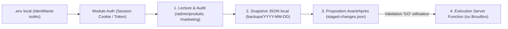

# Document de Conception : Copilote Admin Grafikaly (Catalogue & Marketing)

**Date** : 2026-10-02  
**Projet** : Grafikaly (`https://www.grafikaly.mg`)  
**Approche retenue** : Approche C — Hybride (CLI locale connectée aux Server Functions TanStack Start + Garde-fous natifs `draft` & `dryRun: true`)  
**Mode de gouvernance** : Mode Copilote Sécurisé (Lecture libre, Aperçu Avant/Après ou Brouillon systématique, Application uniquement après "GO" explicite dans le chat)

---

## 1. Objectif et Périmètre

Permettre à l'agent copilote d'administrer de manière sécurisée, rapide et réversible deux pôles stratégiques de la plateforme **Grafikaly** :
1. **Catalogue, Prix & Copywriting** (`/admin/produits`, `/admin/categories`, `/admin/offres`, `/admin/combos`) :
   - Mise en place des prix d'ancrage barrés (`compare_at_price_mga`) basés sur les prix officiels convertis en Ariary.
   - Optimisation psychologique des descriptions produits (cadrage au coût journalier en Ariary, aversion à la perte, clarté du mode d'accès).
   - Réorganisation des catégories (ex. création/assignation d'une catégorie dédiée IA) et activation ciblée de `promo_code_enabled`.
   - Configuration des règles de vente croisée (`combos` / Order Bumps au panier).
2. **Marketing & Emailing** (`/admin/marketing`, `/admin/codes-promo`, `/admin/ventes-flash`) :
   - Audit des segments réels (`all_active`, `expiring_7d`, `expired`, `waitlist_product`, `loyalty_tier`, `product_buyers`).
   - Création et mise à jour de campagnes email en statut **Brouillon (`draft`)** et envoi d'emails de test (`sendTestEmail`).
   - Simulation (`dryRun: true`) et configuration des séquences d'automatisation (relances d'expiration J-7 / J-3 / J+1, retour en stock, bienvenue).
   - Gestion des codes promotionnels et programmation des ventes flash.
3. **Lecture Analytique (`scope: 'real'`)** :
   - Consultation en lecture seule des statistiques de ventes, abonnements et performances marketing afin de mesurer le retour sur investissement (ROI) de chaque optimisation.

### Exclusions strictes (Hors périmètre d'écriture)
L'outil n'implémentera **aucune** fonction d'écriture sur :
- `/admin/paiements` (validation/rejet financier Mobile Money)
- `/admin/comptes-services` (identifiants et mots de passe des comptes maîtres partagés)
- `/admin/utilisateurs` (gestion des rôles et accès administrateurs)
- `/admin/parametres` (paramètres critiques d'infrastructure)

---

## 2. Architecture Technique & Sécurité

### 2.1 Gestion sécurisée des identifiants (Protocole `credentials`)
- Les identifiants (`GRAFIKALY_ADMIN_EMAIL` et `GRAFIKALY_ADMIN_PASSWORD`) sont stockés exclusivement dans `c:\Users\sylvi\DEV\GRAFIKALY\.env`.
- Le fichier `.env` et le dossier `backups/` (contenant des données internes) sont exclus du suivi Git via `.gitignore`.
- Les identifiants ne sont jamais affichés dans le terminal ni transmis en clair dans l'historique du chat.

### 2.2 Composants de la CLI locale (`src/`)
1. **`src/lib/client.mjs`** :
   - Gère l'authentification auprès de `https://www.grafikaly.mg` (via l'endpoint d'authentification Supabase / `@lovable.dev/cloud-auth-js` et les cookies de session TanStack Start).
   - Fournit un client HTTP générique capable d'appeler les Server Functions `/_server/...` avec reconnexion automatique si la session expire.
2. **`src/lib/backup.mjs`** :
   - Avant toute opération de modification, sauvegarde l'état actuel de l'entité ciblée dans `backups/<timestamp>-<entity>.json`.
   - Permet une restauration instantanée (`rollback`) à partir de n'importe quel snapshot.
3. **`src/catalog.mjs` (`catalog-manager`)** :
   - Commandes : `dump`, `diff <staged-file>`, `apply <staged-file> --confirm`, `rollback <backup-file>`.
   - Valide les schémas avant envoi (ex. `compare_at_price_mga > price_mga`, fusion complète des champs existants pour éviter tout écrasement accidentel).
4. **`src/marketing.mjs` (`marketing-manager`)** :
   - Commandes : `status`, `preview-segment`, `save-draft <campaign-file>`, `send-test <campaign-id> <email>`, `simulate-automation <rule-id>`, `upsert-promo <promo-file> --confirm`.
   - Verrou logiciel : la création/modification de campagne force `status: 'draft'` par défaut.

---

## 3. Gestion des Erreurs & Stratégie de Tests

### Garde-fous d'exécution
- **Validation des données** : Rejet automatique si un prix est $\le 0$, si `compare_at_price_mga` $\le$ `price_mga`, ou si un champ obligatoire (`name`, `slug`, `category_id`) est manquant.
- **Idempotence & Fusion** : Lors de la modification d'un produit, le script lit toujours l'objet complet fraîchement récupéré depuis le serveur, applique uniquement le delta validé, puis soumet l'objet complet attendu par la mutation TanStack Start.

### Plan de test progressif
1. **Étape 1 (Auth & Lecture seule)** : Connexion et création du snapshot initial complet (`backups/initial-snapshot.json`).
2. **Étape 2 (Simulation sèche)** : Exécution d'un `diff` catalogue sans écriture et d'un `dryRun: true` sur les automatisations marketing.
3. **Étape 3 (Test pilote unitaire)** : Création d'un brouillon de campagne email (non envoyé) et mise à jour pilote d'un seul produit après validation.
