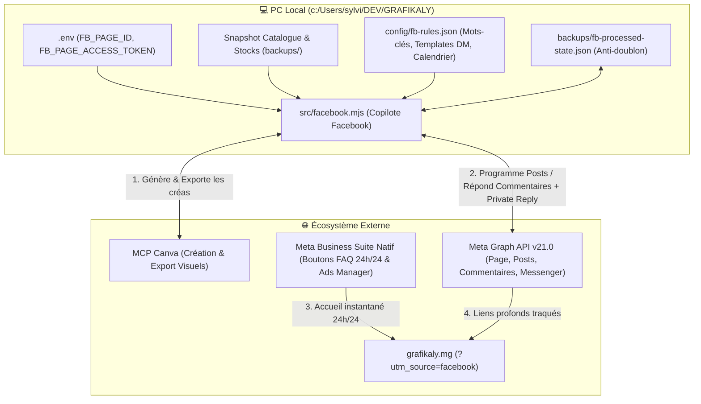

# Document de Conception : Stratégie Marketing & Automatisation Facebook (Grafikaly)

**Date** : 2026-10-05  
**Projet** : Grafikaly (`https://www.grafikaly.mg`)  
**Discussion de référence** : [`448d6684-25b0-4957-8ba2-b6f812e51e80`](conversation://448d6684-25b0-4957-8ba2-b6f812e51e80)  
**Approche retenue** : Approche A — CLI « Copilote Facebook » Unifiée 100 % Locale (`src/facebook.mjs`) + Règles JSON (`config/fb-rules.json`) + Connecteur MCP Canva + Meta Business Suite Natif  
**Mode de gouvernance** : Mode Copilote Sécurisé (`--dry-run` par défaut, exécution réelle uniquement avec `--confirm` après validation `"GO"` de l'utilisateur)

---

## 1. Objectif et Périmètre

Construire un système **100 % local sur le PC de l'utilisateur** (`c:\Users\sylvi\DEV\GRAFIKALY`) permettant d'automatiser l'acquisition, l'engagement et la conversion de la Page Facebook **Grafikaly** vers le tunnel e-commerce autonome `https://www.grafikaly.mg` (paiement Mvola / Orange Money) :

1. **Pilier 1 — Répondeur Automatique Commentaires + DM (`fb:comments`)** :
   - Détection des intentions d'achat (*"Prix"*, *"Mp"*, *"Dispo"*, *"Ohatrinona"*, *"Info"*, *"Mvola"*) sous les publications organiques et publicitaires.
   - Double action via l'API Meta Graph : **Réponse publique rotative** sous le commentaire + **Message privé (`private_replies`)** contenant le prix en Ariary, l'économie par rapport au prix officiel USD/EUR, le stock restant et le lien direct traqué (`?utm_source=facebook&utm_medium=comment_dm`).
2. **Pilier 2 — Qualification & Redirection Messenger (`fb:messenger` + Meta Business Suite)** :
   - Niveau 1 (24h/24 sans serveur) : 4 boutons de questions fréquentes (Icebreakers) dans Meta Business Suite redirigeant vers `grafikaly.mg` et expliquant le paiement Mobile Money.
   - Niveau 2 (Local) : Scan de la boîte de réception Messenger (`src/facebook.mjs inbox`) pour détecter le produit recherché et envoyer la fiche correspondante en un clic.
3. **Pilier 3 — Usine à Contenus & Programmation (`fb:content` + MCP Canva)** :
   - Génération du calendrier éditorial hebdomadaire synchronisé avec l'état réel des stocks (`digital_inventory`) pour ne jamais promouvoir un produit en rupture.
   - Création et export des visuels via le serveur MCP **Canva**, et programmation des posts sur la Page Facebook (`published: false`, `scheduled_publish_time`).
4. **Pilier 4 — Architecte de Campagnes Facebook Ads (`fb:ads`)** :
   - Génération de kits publicitaires complets (Copies A/B basées sur les 4 angles psychologiques Madagascar, visuels Canva `1080x1080` et `1080x1920`, ciblage et retargeting).

---

## 2. Architecture Technique & Flux de Données

### 2.1 Composants Locaux
1. **`src/lib/fb-client.mjs`** :
   - Client HTTP dédié à l'API Meta Graph (`https://graph.facebook.com/v21.0`).
   - Lit `FB_PAGE_ID` et `FB_PAGE_ACCESS_TOKEN` depuis `.env` sans jamais les exposer dans le terminal.
   - Intègre un limiteur de débit (délai configurable `3000ms` à `6000ms` entre les écritures) et la gestion des erreurs d'API Meta (codes `10`, `100`, `190`, `368`).
2. **`config/fb-rules.json`** :
   - Dictionnaire d'intentions bilingue Français / Malagasy (`prix`, `mp`, `ohatrinona`, `dispo`, `mvola`, `smart tv`, etc.).
   - 5 variantes de réponses publiques aux commentaires (rotation anti-spam).
   - Modèles de messages privés (`Private Reply` et `Messenger Inbox`) avec variables dynamiques (`{{first_name}}`, `{{product_name}}`, `{{price_mga}}`, `{{official_price_mga}}`, `{{savings_pct}}`, `{{daily_cost_mga}}`, `{{product_url}}`).
   - Table de correspondance `post_id -> product_slug` (avec détection automatique du produit à partir du texte du post si non mappé manuellement).
3. **`src/facebook.mjs`** :
   - Interface en ligne de commande (CLI) exposant :
     - `status` : Vérifie la validité du `FB_PAGE_ACCESS_TOKEN`, les permissions de la Page et affiche les 5 derniers posts.
     - `comments [--post-id <id>] [--confirm]` : Scanne les commentaires non traités, prépare les réponses publiques + DM privés en mode simulation (`--dry-run` par défaut) ou les envoie avec `--confirm`.
     - `inbox [--confirm]` : Scanne les conversations Messenger en attente, identifie les produits demandés et prépare/envoie les réponses.
     - `generate-calendar [--week <n>]` : Génère un plan de publications hebdomadaire basé sur les stocks réels et le benchmark des prix officiels.
     - `schedule-posts <plan-file> [--confirm]` : Programme les publications validées sur la Page Facebook via Meta Graph API.

---

## 3. Matrice Stratégique des Contenus & Publicités (Marché Madagascar)

| Pilier Hebdomadaire | Produits Cibles | Levier Psychologique | Angle de Copywriting |
| :--- | :--- | :--- | :--- |
| **1. Le Choc des Devises (Double Ancrage)** | `Canva Pro`, `Framer Pro`, `Lovable Pro`, `Coursera Pro`, `LinkedIn`, `Notion`, `n8n` | Prix Officiel USD/EUR + Frais Visa vs Prix Ariary Mvola | Montrer l'économie réelle en centaines de milliers ou millions d'Ariary (`-70 %` à `-88 %`) et l'absence de carte bancaire internationale. |
| **2. L'Effet « Mofo Gasy » (Coût par jour)** | `Canva 12m` (`270 Ar/j`), `Duolingo 12m` (`270 Ar/j`), `Spotify 12m` (`350 Ar/j`), `Netflix`, `Prime` | Fractionnement temporel journalier en Ariary | Ramener un abonnement annuel ou mensuel à une dépense quotidienne dérisoire en Ariary. |
| **3. Preuve Sociale & Urgence de Stock** | `Netflix Smart TV` (`10/12`), `Canva Pro` (`66/80`), `Prime Video` (`18/30`), `Descript` (`2/5`) | Rareté réelle issue de `digital_inventory` | Annoncer le nombre exact de places restantes sur les comptes maîtres de la semaine. |
| **4. B2B & Revenus en Devises (ROI)** | `Création Site E-commerce 24h` (`349 000 Ar`), `Ultimate IA Pack` (`649 000 Ar`) | Aversion à la perte d'opportunité & ROI dès le 1er client | Cadrer l'achat comme un investissement remboursé dès la première commande client. |

---

## 4. Garde-fous, Gestion des Erreurs & Stratégie de Tests

1. **Règle d'Or `--dry-run` par défaut** : Aucune publication ni réponse aux commentaires/messages n'est envoyée sur Facebook sans l'argument explicite `--confirm` après validation de l'aperçu par l'utilisateur.
2. **Gestion de la fenêtre Meta des 7 jours (`private_replies`)** : Si un commentaire date de plus de 7 jours (limite de l'API Meta pour `private_replies`), le script bascule proprement vers une réponse en commentaire public contenant le lien direct vers la fiche produit sur `grafikaly.mg`.
3. **Registre d'idempotence (`backups/fb-processed-state.json`)** : Chaque `comment_id` ou `message_id` traité est enregistré localement avec son horodatage pour garantir qu'aucun client ne reçoive deux fois la même réponse automatique.
4. **Vérification de disponibilité (`digital_inventory`)** : Si un prospect commente sous un ancien post d'un produit passé en rupture (`unavailable`), le message généré l'informe honnêtement de la rupture temporaire et l'invite à rejoindre la liste d'attente sur la fiche produit ou lui suggère l'alternative active.
